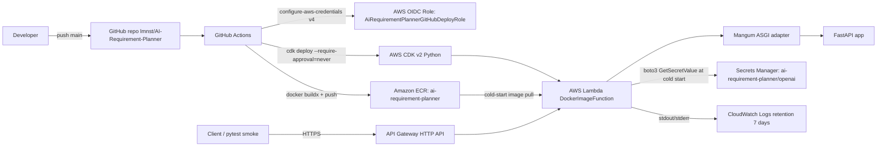

# AI Requirement Planner

A minimal but structured AI backend project built with **Python, FastAPI, OpenAI API, Pydantic, and Pytest**.

This project takes a natural-language software requirement as input and converts it into structured JSON outputs for:

* implementation planning
* test case generation

The focus of this project is not just calling an LLM, but building a **reliable backend pipeline** around it:

* structured output parsing
* schema validation with Pydantic
* defensive error handling
* test coverage for both success and failure cases
* clean project layering with routes / services / schemas / utils

---

## Features

### 1. Generate implementation plans

`POST /generate-plan`

Input a requirement description and return a structured development plan:

* summary
* tasks
* implementation plan
* test checklist

### 2. Generate test cases

`POST /generate-test-cases`

Input a requirement description and return structured test suggestions:

* feature summary
* test scenarios
* edge cases

### 3. Structured output enforcement

LLM responses are parsed with `json.loads()` and validated using Pydantic models.

### 4. Defensive error handling

The backend handles common failure modes such as:

* empty input
* invalid JSON returned by the model
* missing required fields
* unexpected extra fields

### 5. Automated tests

Pytest is used to verify:

* happy path behavior
* empty input handling
* invalid JSON handling
* schema validation failures

---

## Tech Stack

* **Python**
* **FastAPI**
* **OpenAI API**
* **Pydantic**
* **Pytest**

---

## Project Structure

```text
AI-Requirement-Planner/
├─ app
│  ├─ config.py
│  ├─ main.py
│  ├─ prompt.py
│  ├─ routes
│  │  ├─ planner.py
│  │  └─ __init__.py
│  ├─ schemas.py
│  ├─ services
│  │  ├─ llm_service.py
│  │  ├─ planner_service.py
│  │  └─ __init__.py
│  ├─ utils.py
│  └─ __init__.py
├─ README.md
├─ requirements.txt
└─ tests
   ├─ test_main.py
   ├─ test_parser.py
   └─ Test.py
```

---

## Architecture Overview

### `app/main.py`

FastAPI application entrypoint.

### `app/routes/planner.py`

Defines the API endpoints:

* `/generate-plan`
* `/generate-test-cases`

This layer is responsible only for request/response handling.

### `app/services/llm_service.py`

Encapsulates OpenAI API calls.

### `app/services/planner_service.py`

Contains the core business logic:

* validate request input
* prepare prompts
* call the LLM service
* parse and validate model output

### `app/schemas.py`

Defines Pydantic request/response models.

### `app/utils.py`

Contains shared utility logic such as JSON parsing and validation helpers.

### `app/config.py`

Stores configuration such as model settings and environment variables.

---

## API Endpoints

### `POST /generate-plan`

#### Request

```json
{
  "requirement": "Build a todo app with add, delete, and filter features."
}
```

#### Response

```json
{
  "summary": "A todo application with task management and filtering capabilities.",
  "tasks": [
    "Design API endpoints",
    "Implement CRUD logic",
    "Add filtering support"
  ],
  "implementation_plan": [
    "Create task schema",
    "Build FastAPI routes",
    "Implement service logic"
  ],
  "test_checklist": [
    "Test task creation",
    "Test task deletion",
    "Test filtering behavior"
  ]
}
```

---

### `POST /generate-test-cases`

#### Request

```json
{
  "requirement": "Build a todo app with add, delete, and filter features."
}
```

#### Response

```json
{
  "feature_summary": "Todo app with task creation, deletion, and filtering.",
  "test_scenarios": [
    "Add a new task successfully",
    "Delete an existing task",
    "Filter tasks by status"
  ],
  "edge_cases": [
    "Submitting an empty task",
    "Deleting a non-existent task",
    "Applying an unsupported filter"
  ]
}
```

---

## Error Handling

This project explicitly validates both user input and LLM output.

Examples of handled errors:

* empty `requirement`
* invalid JSON returned by the LLM
* missing required fields in parsed output
* extra unexpected fields when schema forbids them

This helps make the API response more stable and predictable for downstream consumers.

---

## Running the Project

### 1. Clone the repository

```bash
git clone https://github.com/lmnst/AI-Requirement-Planner.git
cd AI-Requirement-Planner
```

### 2. Create and activate a virtual environment

```bash
python -m venv venv
```

#### Windows

```bash
venv\Scripts\activate
```

#### macOS / Linux

```bash
source venv/bin/activate
```

### 3. Install dependencies

```bash
pip install -r requirements.txt
```

### 4. Configure environment variables

Create a `.env` file and add your OpenAI API key:

```env
OPENAI_API_KEY=your_api_key_here
```

If your project uses additional config fields, add them here as well.

### 5. Run the server

```bash
uvicorn app.main:app --reload
```

### 6. Open API docs

FastAPI automatically provides interactive documentation at:

* `http://127.0.0.1:8000/docs`

---

## Running Tests

Run all tests:

```bash
pytest
```

Or run specific test files:

```bash
pytest tests/test_main.py
pytest tests/test_parser.py
```

---

## What This Project Demonstrates

This project demonstrates practical backend engineering around LLM output:

* turning free-form requirements into structured data
* validating model responses before returning them
* separating API layer from business logic
* writing tests for both normal and failure cases
* building an AI backend that is more robust than a simple prompt wrapper

---

## Limitations

Current limitations include:

* single-step generation only
* no workflow orchestration yet
* no persistence layer
* no retry / logging / observability pipeline yet
* output quality still depends on prompt quality and model behavior

---

## Next Steps

Planned improvements:

* add a multi-step workflow endpoint
* chain plan generation and test generation
* introduce logging and better observability
* improve prompt management
* move toward agent/workflow-style orchestration

---

## Learning Goal

This project was built as a hands-on step from:

* basic API development
* to structured AI backend engineering
* and eventually toward workflow / agent-based systems

It is intentionally small in scope, but designed to be extended incrementally.

---

## AWS Lambda Deployment (Container + CDK + GitHub Actions OIDC)

This repository ships an AWS Lambda deployment path on top of the same FastAPI app, using a Lambda container image (Python 3.12 base), API Gateway HTTP API, CDK v2 Python infrastructure, AWS Secrets Manager for `OPENAI_API_KEY`, and GitHub Actions with AWS OIDC federation for CI/CD. The region is pinned to `eu-central-1`.


### Architecture



### Pinned configuration

* Region: `eu-central-1` (hardcoded in `infra/app.py`)
* Lambda base image: `public.ecr.aws/lambda/python:3.12`
* Lambda memory: 1024 MB
* Lambda timeout: 30 seconds
* Lambda architecture: x86_64
* CloudWatch retention: 7 days
* OIDC `sub` trust: `repo:lmnst/AI-Requirement-Planner:ref:refs/heads/main`
* ECR tag mutability: IMMUTABLE
* ECR lifecycle: keep last 10 tagged, expire untagged after 7 days

### Deploy from scratch (5-phase overview)

1. `cdk bootstrap aws://<AWS_ACCOUNT_ID>/eu-central-1`
2. `cdk deploy AiRequirementPlannerFoundation -c skip_application=true` (creates ECR, OIDC provider, deploy role, secret placeholder)
3. `aws secretsmanager put-secret-value --secret-id ai-requirement-planner/openai --secret-string '<your OPENAI_API_KEY>'`
4. `docker buildx build --platform linux/amd64 ...` then `docker push` to the ECR repo
5. `cdk deploy AiRequirementPlannerApplication -c image_tag=<git-sha>` (or `-c image_digest=sha256:...`)

Once `ApiUrl` is in the output, set `API_BASE_URL` and run `pytest -q tests/test_deployed.py`. Subsequent deploys are handled by GitHub Actions on each push to `main`.

### Local development

```powershell
py -3.10 -m venv .venv
.\.venv\Scripts\python.exe -m pip install -r requirements.txt
$env:OPENAI_API_KEY = "<your key>"
.\.venv\Scripts\python.exe -m uvicorn app.main:app --reload
```

Then open `http://127.0.0.1:8000/docs`.

Run the existing offline test suite (TestClient with monkeypatched LLM client; any non-empty `OPENAI_API_KEY` works):

```powershell
$env:OPENAI_API_KEY = "sk-test-dummy"
.\.venv\Scripts\python.exe -m pytest -q
```

### Local Docker Lambda smoke test

```powershell
docker build --platform linux/amd64 -t ai-requirement-planner:local .
$env:OPENAI_API_KEY = "<your key>"
docker run --rm -d -p 9000:8080 -e OPENAI_API_KEY --name aip-test ai-requirement-planner:local
```

Manual Lambda Runtime API invocation (the synthetic v2 event MUST include `sourceIp`, see Troubleshooting):

```powershell
$evt = '{"version":"2.0","rawPath":"/generate-plan","requestContext":{"http":{"method":"POST","path":"/generate-plan","sourceIp":"127.0.0.1"}},"headers":{"content-type":"application/json"},"body":"{\"requirement\":\"build a todo app\"}","isBase64Encoded":false}'
Invoke-RestMethod -Uri http://localhost:9000/2015-03-31/functions/function/invocations -Method POST -Body $evt -ContentType application/json
docker stop aip-test
Remove-Item Env:OPENAI_API_KEY
```

Expected response shape: `statusCode=200`, `body` is a JSON string with keys `summary`, `tasks`, `implementation_plan`, `test_checklist`.

### AWS deployment, step by step

Prerequisites:

* AWS CLI v2 configured (`aws sts get-caller-identity` returns the target account)
* CDK CLI: `npm install -g aws-cdk` (or use `npx -y aws-cdk` per invocation)
* Region pinned to `eu-central-1`
* Docker Desktop running for local image build

```powershell
py -3.10 -m venv infra\.venv
infra\.venv\Scripts\python.exe -m pip install -r infra\requirements.txt
cd infra
$env:PATH = "$PWD\.venv\Scripts;$env:PATH"

cdk bootstrap aws://<AWS_ACCOUNT_ID>/eu-central-1

cdk deploy AiRequirementPlannerFoundation --require-approval=never -c skip_application=true
```

Record the outputs printed by FoundationStack: `EcrRepoUri`, `GitHubDeployRoleArn`, `OpenAiSecretName`, `OpenAiSecretArn`.

Inject the OpenAI key out-of-band (never commit this command with a real value):

```powershell
aws secretsmanager put-secret-value --secret-id ai-requirement-planner/openai --secret-string '<your key>'
```

Build, tag, and push the image:

```powershell
cd ..
aws ecr get-login-password --region eu-central-1 | docker login --username AWS --password-stdin <AWS_ACCOUNT_ID>.dkr.ecr.eu-central-1.amazonaws.com
docker buildx build --platform linux/amd64 --provenance=false --tag <AWS_ACCOUNT_ID>.dkr.ecr.eu-central-1.amazonaws.com/ai-requirement-planner:<git-sha> --push .
```

Deploy ApplicationStack with the freshly pushed image:

```powershell
cd infra
cdk deploy AiRequirementPlannerApplication --require-approval=never -c image_tag=<git-sha>
```

Record `ApiUrl` from the stack output.

### GitHub Actions OIDC setup

After `cdk deploy AiRequirementPlannerFoundation` has succeeded:

1. In the GitHub repo, go to `Settings -> Secrets and variables -> Actions -> Variables`.
2. Add a Variable named `AWS_DEPLOY_ROLE_ARN` with value `<GitHubDeployRoleArn>` from the FoundationStack outputs. Store it as a Variable, not a Secret (the ARN is not sensitive but is account-identifying; you can choose to put it in a Secret instead if you prefer).
3. Confirm that the IAM role trust policy restricts `sub` exactly to `repo:lmnst/AI-Requirement-Planner:ref:refs/heads/main`. Any other branch or repo will be denied at STS.

Trust policy outline (managed by CDK, shown here only for reference; do not edit by hand):

```json
{
  "Version": "2012-10-17",
  "Statement": [
    {
      "Effect": "Allow",
      "Principal": {"Federated": "arn:aws:iam::<AWS_ACCOUNT_ID>:oidc-provider/token.actions.githubusercontent.com"},
      "Action": "sts:AssumeRoleWithWebIdentity",
      "Condition": {
        "StringEquals": {
          "token.actions.githubusercontent.com:aud": "sts.amazonaws.com",
          "token.actions.githubusercontent.com:sub": "repo:lmnst/AI-Requirement-Planner:ref:refs/heads/main"
        }
      }
    }
  ]
}
```

The CDK-managed deploy role currently uses the broad `AdministratorAccess` managed policy as a deliberate first-deploy convenience. Once the pipeline is reliably green, tighten it to a least-privilege policy covering: CloudFormation on these two stacks, ECR on this repo, Lambda on this function, ApiGatewayV2 on this api, Logs on this log group, `iam:PassRole` on the Lambda execution role, `secretsmanager:GetSecretValue` and `DescribeSecret` on the openai secret, `sts:AssumeRole` on `cdk-*` bootstrap roles.

### Online smoke test

```powershell
$env:API_BASE_URL = "<ApiUrl from ApplicationStack>"
pytest -q tests/test_deployed.py
```

If `API_BASE_URL` is unset the suite skips itself, so `pytest -q` still passes locally without a deployed stack.

### Cost analysis

These figures are order-of-magnitude only. Verify against current AWS pricing before relying on them.

| Component | Notes |
|-----------|-------|
| Lambda | 1M req/month + 400k GB-s free; a hobby workload almost never exceeds this |
| API Gateway HTTP API | About 1.00 USD per 1M requests in eu-central-1 |
| CloudWatch Logs | Roughly 0.50 USD/GB ingest, 0.03 USD/GB-month storage; 7-day retention keeps storage cost tiny |
| Secrets Manager | Roughly 0.40 USD per secret per month + per-API-call. NOT covered by AWS Free Tier. This is the only recurring fixed cost in the stack |
| ECR storage | Roughly 0.10 USD/GB-month; one Lambda image is ~1 GB. Lifecycle policy keeps the last 10 images |
| NAT Gateway | Zero. The Lambda is not in a VPC |

Destroy all resources when not in active use.

### Security notes

* `OPENAI_API_KEY` lives only in AWS Secrets Manager. It is NOT in code, NOT in Docker images, NOT in GitHub Secrets, NOT in CDK source files.
* GitHub Actions uses AWS OIDC. There are NO long-lived AWS access keys in GitHub Secrets.
* The OIDC role trust is restricted to a single `sub`: `repo:lmnst/AI-Requirement-Planner:ref:refs/heads/main`. Pushes to other branches cannot deploy.
* The deployed API Gateway URL is public. Anyone who knows it can call it (and burn your OpenAI quota). Consider adding API key auth, Cognito JWT authorization, or AWS WAF before sharing the URL.
* ECR images use IMMUTABLE tag mutability; the same tag cannot be overwritten.
* CloudWatch logs are retained for 7 days only.

### How to destroy

```powershell
cd infra
$env:PATH = "$PWD\.venv\Scripts;$env:PATH"
cdk destroy AiRequirementPlannerApplication
```

FoundationStack must be destroyed second, and only after manually emptying the ECR repository (it uses `RemovalPolicy.RETAIN` and refuses to delete while images exist):

```powershell
aws ecr list-images --repository-name ai-requirement-planner --query "imageIds[*]" --output json | Set-Content images.json
aws ecr batch-delete-image --repository-name ai-requirement-planner --image-ids file://images.json
cdk destroy AiRequirementPlannerFoundation
```

Secrets Manager has a 7 to 30 day recovery window by default. To force-delete (irreversible):

```powershell
aws secretsmanager delete-secret --secret-id ai-requirement-planner/openai --force-delete-without-recovery
```

If your AWS account is shared with other projects and already had a `token.actions.githubusercontent.com` OIDC provider before this stack was deployed, do NOT let CDK destroy delete it. Detach it from this stack manually, or re-deploy the foundation with `-c existing_github_oidc_arn=<arn>` so CDK imports rather than creates.

### Troubleshooting

* Local Docker smoke returns empty body or `KeyError: 'sourceIp'`: your manual v2 event is missing `requestContext.http.sourceIp`. Real API Gateway always injects it. Add `"sourceIp": "127.0.0.1"` to the event.
* Lambda cold start raises `RuntimeError("OPENAI_API_KEY is not set and OPENAI_SECRET_NAME is not configured")`: locally you forgot to set `OPENAI_API_KEY`, or in Lambda the function was deployed without `OPENAI_SECRET_NAME` (check the function configuration in the AWS Console).
* `pip install -r requirements.txt` fails with `UnicodeDecodeError`: the file was reverted to UTF-16. Re-save as UTF-8 without BOM, LF line endings.
* `cdk deploy` says the image does not exist: you pushed a tag that does not match the `-c image_tag=` argument, or did not push at all. Confirm with `aws ecr describe-images --repository-name ai-requirement-planner`.
* `iam:CreateOpenIDConnectProvider` fails: your account already has a `token.actions.githubusercontent.com` provider. Find it with `aws iam list-open-id-connect-providers` and re-deploy with `-c existing_github_oidc_arn=<arn>`.
* Mangum `DeprecationWarning: There is no current event loop`: harmless, internal to mangum 0.21.x. Does not affect behavior.

---

API-Study
├─ app
│  ├─ config.py
│  ├─ main.py
│  ├─ prompt.py
│  ├─ routes
│  │  ├─ planner.py
│  │  └─ __init__.py
│  ├─ schemas.py
│  ├─ services
│  │  ├─ llm_service.py
│  │  ├─ planner_service.py
│  │  └─ __init__.py
│  ├─ utils.py
│  └─ __init__.py
├─ README.md
├─ requirements.txt
└─ tests
   ├─ Test.py
   ├─ test_main.py
   └─ test_parser.py

```